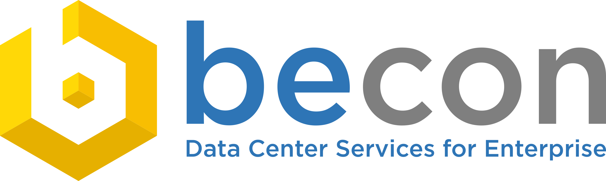

##################
Über uns
##################

We love technology!!! That is our motto in short :-)

Since our foundation in the year 1988, `becon`_ has gone from one of the earliest IT service providers to being a full-service provider of solutions and services in the information and telecommunications technology industry.

Our mission is the implementation and optimization of data center services. Our focus is the automation of processes using both open and closed source solutions. We are a full-service partner, providing the entire range of value-adding services from consultation, strategy, installation, training, rollout, development, support and operational support for medium-sized and large corporations.

`becon`_ is a private company with locations in Munich, Berlin and Fulda. Our Germany-wide coverage allows us to provide on-site support to our customers throughout the country within a few hours – for those occasions when security concerns make remote support a non-option.

Data privacy and protection are core success factors for any reliable IT operation. The strict requirements on this subject area have led to a much greater awareness of security as well as to sophisticated protection and emergency provision strategies.

Azure AddOn is distributed under the `becon license`_.

.. _becon: https://www.becon.de/
.. _becon license: LICENSE.html
