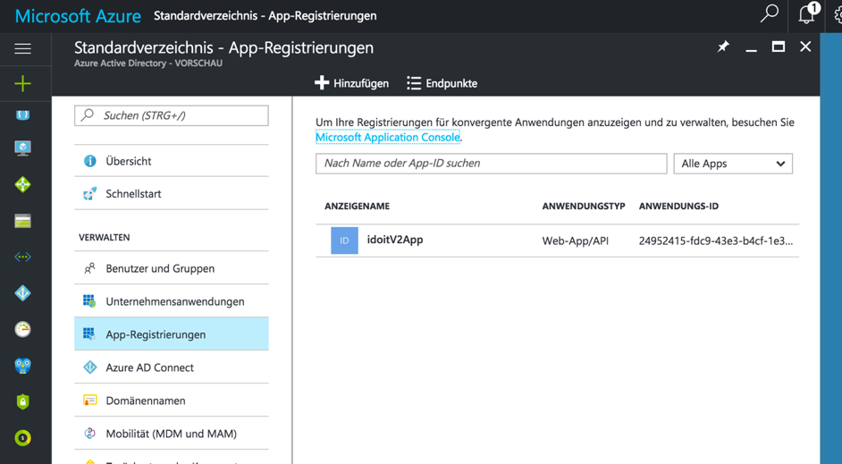
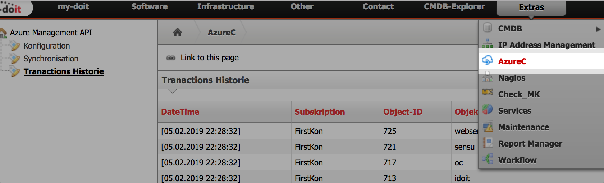
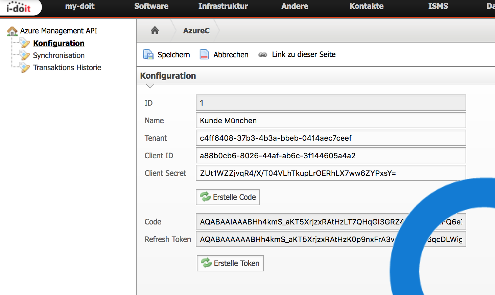

##################
Configuration
##################

=========
Azure
=========

To query the resources of his Azure account (Subscripition) the following points are necessary.

**APP Registrierung**

Open your Azure portal. Click on "Azure Active Directory"

Then click on Add. Now you have to give a name for your registration.
Normally you should choose here a name that describes the APP, which wants to access the AZURE (eg idoitApp).

After completing the registration, you still need to set the answer URL. This url is used in the response of a code generation. Thus, for example, in the case of interface generation with i-doit, the answer can be given as follows:

http://i-doit_webserver.de/module=1202

=========
i-doit
=========

After installed Azure AddOn, you need to set up your connector information.
Click on "Extras" -> "AzureC".

Click new to add a connector. Start with the next five fields.

- id (databaseID will fill out automatically)
- name (set up a connector name)
- tenant (have a look on your azure system. Azure Active Directory->Properties->Directory-ID)
- clientID (get applicationID after installing an "AppRegistration" on Azure Site. see above")

Now click on "Create Code" to get an "Code". 

You will receive now the "refresh-token" and "token". 

