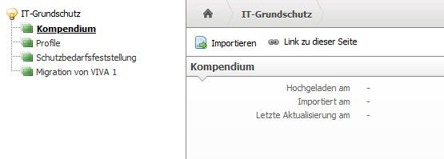
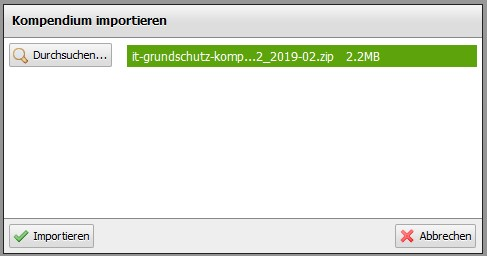

###########
Einrichtung
###########

Bevor man mit dem VIVA2-Addon ein ISMS nach BSI Grundschutz-Methodik aufbauen kann, muss das aktuelle Grundschutzkompendium installiert. Dazu geht man im Menü auf |pfeil| Extras |pfeil| IT-Grundschutz und dort auf den ersten Punkt |pfeil| Kompendium.

Ein Klick auf den "Importieren"-Button öffnet ein Popup, in dem man über den "Durchsuchen"-Button die ZIP-Datei vom Grundschutzkompendium auswählen muss. Nach dem Auswählen wird die Datei automatisch hochgeladen. Ein grüner Balken signalisiert, dass der Upload erfolgreich war.

Ein Klick auf den "Importieren"-Button startet den initialen Import des Grundschutzkompendiums. 

.. note::

    Der Importvorgang kann mehrere Minuten dauern!

 Sobald sich das Popup automatisch schließt, ist der Importvorgang abgeschlossen und auf der Übersichtsseite ist unter "Importiert am" der Zeitstempel des Imports eingetragen.

 Die technische Einrichtung des VIVA2-Addons ist jetzt abgeschlossen.

.. |pfeil| unicode:: U+23F5