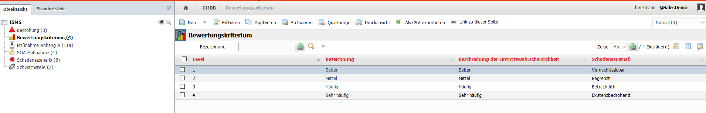
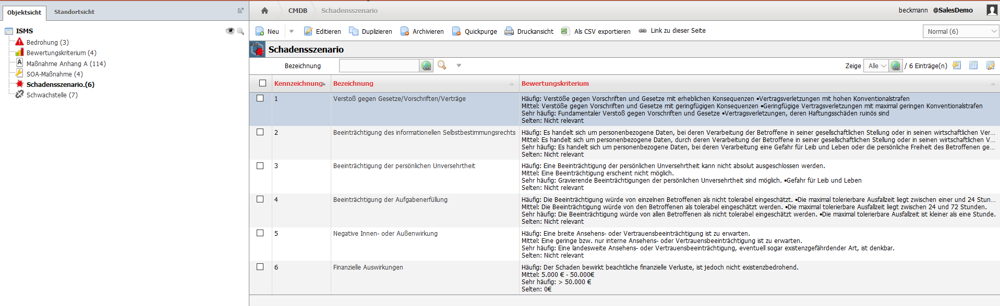
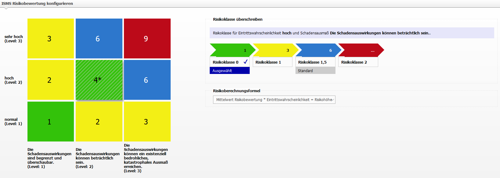
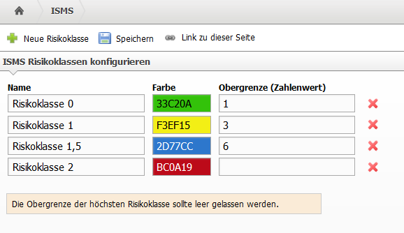
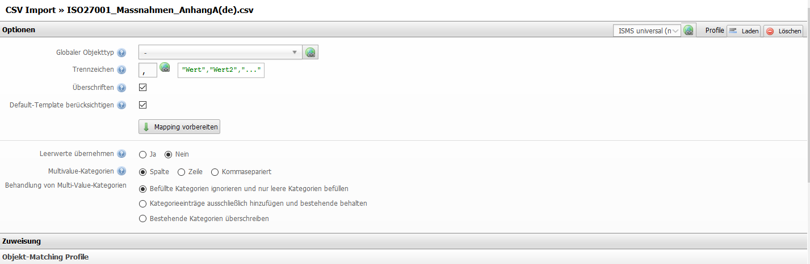

###########
Einrichtung
###########

Bevor man mit dem ISMS-Add-on Risikoeinschätzungen vornehmen kann, müssen vier grundlegende Dinge vorbereitet werden:

* Bewertungskriterien festlegen
* Schadenszenarien beschreiben
* Risikoformel und Risikoklassen definieren
* Maßnahmen anlegen

Der erste Schritt ist die Einrichtung von Bewertungskriterien:
=======

Das Level der Bewertungskritierien wird später für die Berechnung der Risikohöhe genutzt und gilt gleichermaßen für die Eintrittswahrscheinlichkeit und das Schadensausmaß des jeweiligen Bewertungskriteriums. Die Bezeichnung der Bewertungskriterien bildet später die Achsenbeschriftung für die Eintrittswahrscheinlichkeit in der Riskiomatrix, das Schadensausmaß die Achsenbeschriftung für das Schadensausmaß.
Die Level müssen Ganzzahlen sein, Kommazahlen sind derzeit nicht möglich.

Der zweite Schritt ist die Einrichtung der Schadenszenarien:
=======

Die Schadensszenrien, in denen der Schadensausmaß eingeschätzt werden soll, müssen angelegt werden. Beispielhaft wären das:

* Verstoß gegen Gesetze/Vorschriften/Verträge
* Beeinträchtigung des informationellen Selbstbestimmungsrechts
* Beeinträchtigung der persönlichen Unversehrtheit
* Beeinträchtigung der Aufgabenerfüllung
* Nagetive Innen- oder Außenwirkung
* Finanzielle Auswirkungen

Die Kennzeichnung der Schadenszenarien ist nur für die Reihenfolge der Darstellung relevant, muss aber eine Zahl größer null enthalten. In den Schadenszenarien sollte eine textuelle Ausprägung für jedes vorhandene Bewertungskriterium erstellt werden. Die Ausprägungen werden später an den Schiebereglern für die Risikoeinschätzung angezeigt.

Im dritten Schritt müssen die Risikoklassen und die Risikoformel definiert werden.
=======
Die Einstellung für die Risikoformel ist unter |pfeil| Extras |pfeil| ISMS |pfeil| 2. Risikoberechnung zu finden. Die Risikomatrix auf der linken Seite hat genauso viele Zeilen und Spalten, wie zuvor Bewertungskriterien angelegt sind.
Anhand der Risikoberechnungsformel, die auf der rechten Seite ausgewählt wird, ergeben sich die Werte der einzelnen Felder in der Risikomatrix.
Wenn ein Feld in der Risikomatrix ausgewählt wird, kann die errechnete Risikoklasse des entsprechende Feldes mit einer anderen Riskoklasse überschreiben werden. Diese Felder werden mit einem Sternchen gekennzeichnet.

Weitere Risikoklassen können unter |pfeil| Extras |pfeil| ISMS |pfeil| 1. Risikoklassen erstellt werden. Dazu am oberen Bildschirmrand auf den Button "+ Neue Risikoklasse" klicken, einen Namen und eine Farbe vergeben und anschließend die Obergrenzen der Risikoklassen neu zuweisen. Die höchste Risikoklasse sollte keine Obergrenze haben.

Im vierten Schritt werden die Maßnahmen angelegt.
=======
Die SOA-Maßnahmen können sowohl selbst angelegt als auch aus Katalogen oder schon vorhandenen Excellisten per CSV-Import erstellt werden.

Des Weiteren sollten -vor allem wenn eine ISO27001-Zertifizierung angestrebt wird- die Maßnahmen des Anhang A der ISO27001-Norm als Maßnahme Anhang A importiert werden.

Alle Kataloge, die zum Import angeboten werden, sind in der ZIP-Datei des ISMS-Add-ons zu finden. Dazu muss zunächst die Zip-Datei entpackt und anschließend zu folgendem Pfad navigiert werden:
**/src/classes/modules/iso27001/Catalogs**

Die mitgelieferten Kataloge können über den CSV-Import von i-doit (unter |pfeil| Extras |pfeil| CMDB-Import |pfeil| CSV Import) importiert werden. Nach dem Auswählen der hochgeladenen CSV-Datei muss das Import-Profil"ISMS universal (new)"verwendet werden.

Da ein Risiko immer aus Bedrohung und Schwachstelle besteht, empfiehlt es sich, auch von diesen Objekttypen bereits Objekte zu erstellen. Auch hier stehen Kataloge zum Import von elementaren Bedrohungen und Schwachstellen zur Verfügung.

Optional
=======
Als optionale Option kann in den Mandanteneinstellungen der Punkt "Reportviews nach Standortrechten filtern" auf "Ja" gesetzt werden. Mehr zu diesem Thema ist unter `Standortrechte <standortrechte.html>`_ zu finden.

.. |pfeil| unicode:: U+23F5