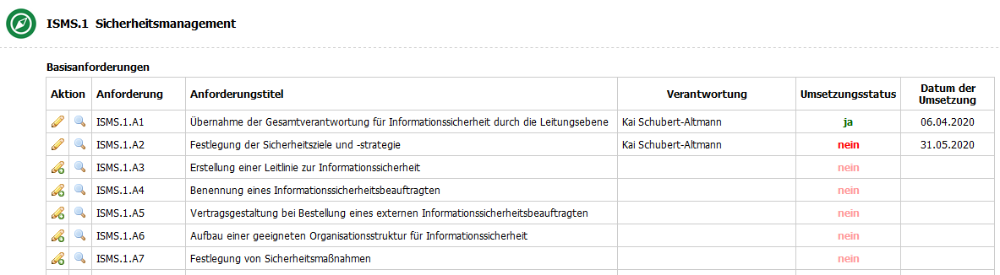
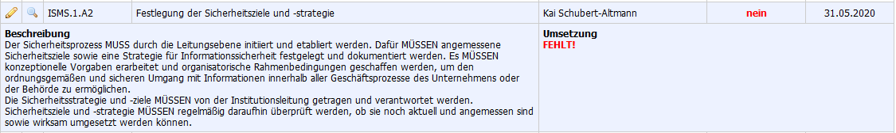
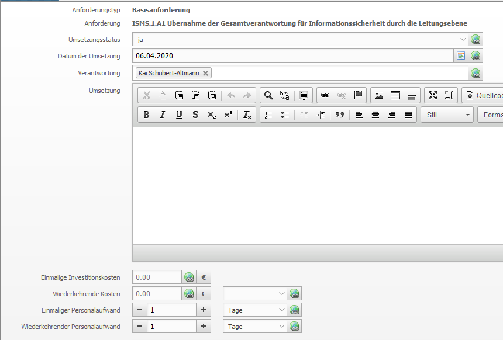
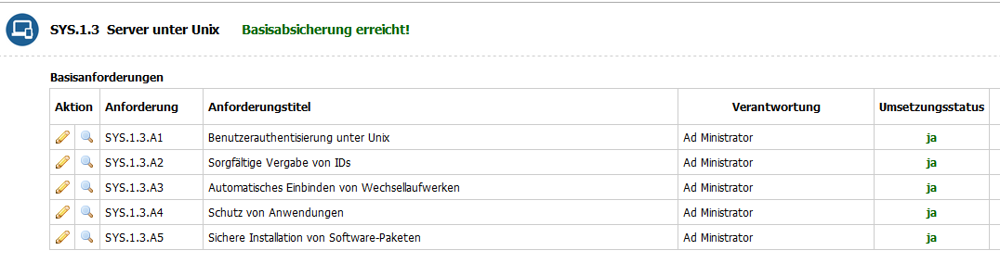

####################
IT-Grundschutz-Check
####################

In der Kategorie "IT-Grundschutz-Check" werden alle Anforderungen aufgelistet, die zu den Bausteinen gehören, die diesem Objekt zugewiesen sind. Dabei werden die Anforderungen sortiert nach Schicht, Baustein und Anforderungstyp aufgelistet. Neben der Anforderungsnummer und dem Titel werden auch die für die Umsetzung der Anforderung Verantwortlichen, der Umsetzungsstatus und das Datum der Umsetzung angezeigt.

Ein Klick auf das Lupensymbol zeigt außerdem noch den Text der Anforderung und die Umsetzungsbeschreibung an.

Ein Klick auf das Stift-Icon öffnet die Bearbeitungsmaske, um den Stand der Umsetzung dieser Anforderung zu dokumentieren. 

.. note::
    In dem Feld "Verantwortung" können nur Einträge hinzugefügt werden, die in der Kontaktzuweisung des zugehörigen Bausteins eingetragen sind.

Wenn alle Basisanforderungen eines Bausteins umgesetzt sind (Umsetzungstatus "Ja"), dann wird der Baustein mit "Basisabsicherung erreicht" markiert.

Analog dazu wird der Baustein mit "Standardabsicherung erreicht" markiert, wenn alle Basisanforderungen umgesetzt sind und alle Standardanforderungen als umgesetzt oder als entbehrlich dokumentiert sind.