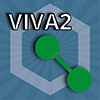

##################################
Objekttyp Kommunikationsverbindung
##################################

Der Objekttyp "Kommunikationsverbindung" dient der Dokumentation der für den Informationsverbund relevanten Kommunikationsverbindungen. In der Standardkonfiguration gehören folgende Kategorien zu Objekten vom Typ Kommunikationsverbindung:

**Allgemein** 
    Gehört zu jedem Objekt.
**IT-Grundschutz (Zielobjekt)** 
    Diese Kategoriegruppierung dient der Zuordnung zum Informationsverbund, der Schutzbedarfsfeststellung, der Zuordnung von Bausteinen und dem IT-Grundschutz-Check (s. :doc:`zielobjektgruppe` für eine ausführlichere Beschreibung).
**Kommunikationsverbindung** 
    Hier kann dokumentiert werden, welche Objekte oder Objektgruppen diese Kommunikationsverbindung verwenden. Von diesen Objekten wird der Schutzbedarf dann (nach dem Maximalprinzip) auf die Kommunikationsverbindung vererbt. Außerdem kann zur Veranschaulichung der Netzplan mit der hervorgehobenen Kommunikationsverbindung verlinkt werden.
**Kontaktzuweisung** 
    Hier sollen die Hauptansprechpartner für die Kommunikationverbindung dokumentiert werden. *(i-doit Standardkategorie)*

