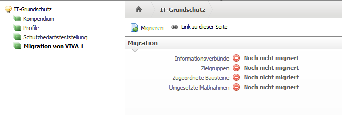
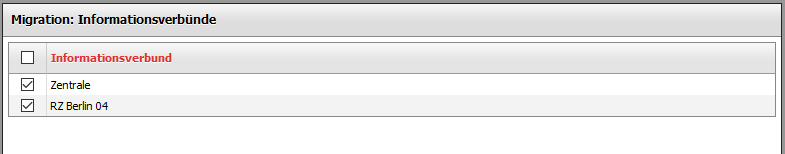
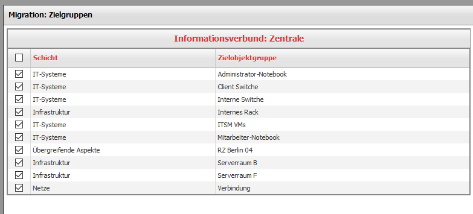
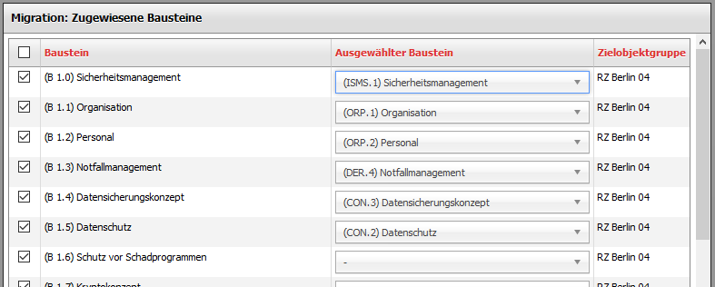
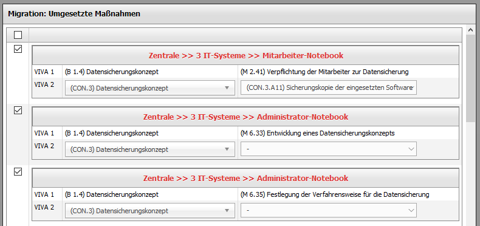
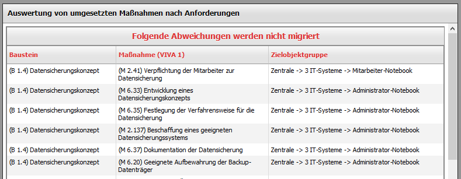
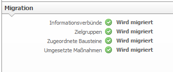

############################
Migration von VIVA1 zu VIVA2
############################

Um Daten aus dem VIVA1-Addon in das VIVA2-Addon zu migrieren, müssen beide Addons installiert und das Grundschutzkompendium im VIVA2-Addon importiert sein. Um die Migration zu starten, geht man im Menü auf |pfeil| Extras |pfeil| IT-Grundschutz und dort auf den Punkt |pfeil| Migeration von VIVA 1. 

Ein Klick auf den Knopf "Migrieren" startet den Migrationsassistenten.

**Schritt 1: Informationsverbünde auswählen**

Im ersten Schritt müssen die Informationsverbünde ausgewählt werden, die migriert werden sollen.

Mit Klick auf den Knopf "Weiter" führt zum Schritt 2.

**Schritt 2: Zielgruppen migrieren**

Im zweiten Schritt werden die Zielobjektgruppen migriert.

Sobald alle zu migrierenden Gruppen markiert sind, geht es mit Klick auf den Knopf "Weiter" zum nächsten Schritt.

**Schritt 3: Bausteine migrieren**

Im dritten Schritt werden die Bausteine des alten Standards in Bausteine des neuen Standards migriert. Dafür muss für jeden in VIVA1 zugewiesenen Baustein aus dem Grundschutzkatalog der entsprechende Baustein aus dem Grundschutzkompendium zugewiesen werden.

Der Migrationsassistent versucht zu erkennen, welches der richtige neue Baustein ist und wählt ihn aus. Diese Auswahl sollte trotzdem bei jedem Baustein auf Richtigkeit überprüft werden. Wenn kein passender Baustein gefunden wurde, dann ist kein Baustein vorausgewählt und es muss einer ausgewählt werden. Wenn kein Zielbaustein ausgewählt wird, wird dieser Baustein nicht migriert. Wenn man die komplette Liste der Bausteine bearbeitet hat, geht es mit einem Klick auf den Knopf "Weiter" zum vierten Schritt.

**Schritt 4: Anforderungen migrieren**

Im vierten Schritt werden die Maßnahmen aus den alten Bausteine auf die Anforderungen des neuen Standards migriert. Ähnlich wie im vorhergehenden Schritt muss für jede in VIVA1 vorhandene Maßnahme aus dem Grundschutzkatalog die entsprechende Anforderung aus dem Grundschutzkompendium zugewiesen werden.

Auch hier versucht der Migrationsassistent zu erkennen, welches die richtige neue Anforderung ist und wählt sie aus. Diese Auswahl sollte trotzdem für jede Anforderung auf Richtigkeit überprüft werden. Wenn keine passende Anforderung gefunden wurde, dann ist keine Anforderung vorausgewählt und es muss eine ausgewählt werden. Wenn kein Anforderung ausgewählt wird, wird diese Anforderung nicht migriert. Wenn man die komplette Liste der Maßnahmen/Anforderungen bearbeitet hat, geht es mit einem Klick auf den Knopf "Weiter" zum letzten Schritt.

**Schritt 5: Migration starten**

Im letzten Schritt werden alle Maßnahmen zur Überprüfung angezeigt, die nicht migriert werden.

Ein Klick auf den Knopf "Migration starten" schließt den Assistenten und startet das eigentlich Migrationsskript. Je nach Datenmenge kann die Migration mehrere Minuten in Anspruch nehmen.

Sobald auf der Übersichtsseite vor allen Punkten ein grüner Haken ist, ist die Migration abgeschlossen.

.. |pfeil| unicode:: U+23F5