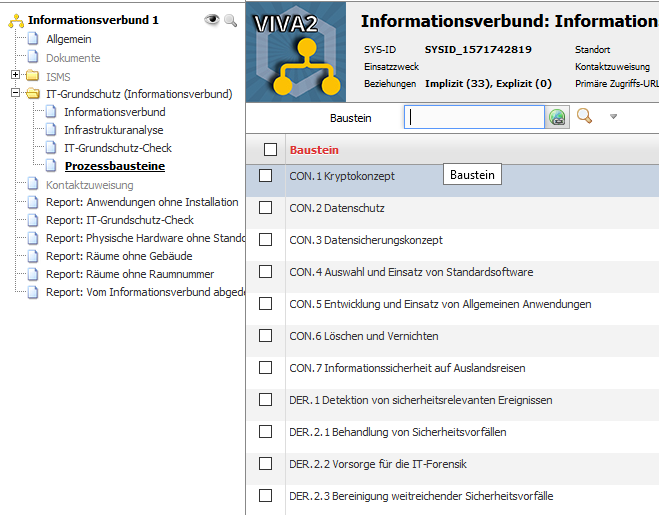
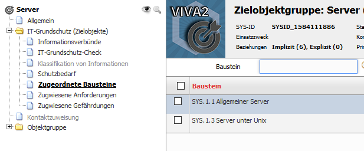

######################################
Modellierung des Informationsverbundes
######################################

Bei der Modellierung des Informationsverbundes müssen hauptsächlich die Bausteine des Grundschutzkompendiums dem Informationsverbund und seinen Zielobjekten bzw. Zielobjektgruppen zugerdnet werden. Unterschieden wird hier zwischen der Zuweisung von Prozessbausteinen am Informationsverbund und von hauptsächlich System-)Bausteinen an Zielobjekten bzw. Zielobjektgruppen.

Die Zuweisung von Prozessbausteinen zum Informationsverbund geschieht über die Kategorie "Prozessbausteine" am Informationsverbund.

Hier müssen jetzt alle relevanten Prozessbausteine dem Informationsverbund zugewiesen werden.

Die Zuweisung von Bausteinen zu Zielobjekten/Zielobjektgruppen geschieht über die Kategorie "Zugeordnete Bausteine" am Zielobjekt/an der Zielobjektgruppe.

Hier müssen jetzt alle für dieses Zielobjekt/diese Zielobjektgruppe relevanten Systembausteine zugeordnet werden. Es können natürlich auch Prozessbausteine zugeordnet werden, wenn dies an dieser Stelle sinnvoll ist (z.B. abweichende Backupkonzepte für einzelne Objekte).

**Kontaktzuweisungen**

Für jeden verwendeten Baustein sollten die Verantwortlichkeiten entsprechend über die Kategorie "Kontaktzuweisung" eingetragen werden.

**Reihenfolge**

Über die Spalte "Reihenfolge" kann eine Bearbeitungsreihenfolge der Bausteine eingetragen werden.
