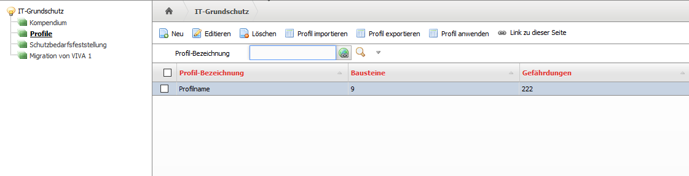
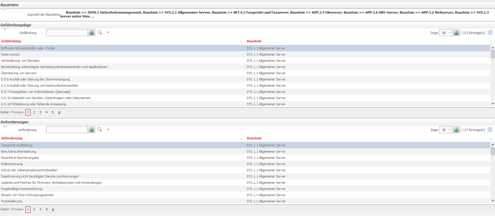
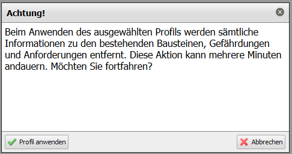

######################
IT-Grundschutz-Profile
######################

In VIVA-2 können Grundschutzprofile angelegt, exportiert, importiert und angewendet werden. Ein Profil besteht aus einem Subset von Bausteinen mit zugehörigen Anforderungen und Gefährdungen.

Zur Profilverwaltung kommt man über die Menüpunkte |pfeil| Extras |pfeil| IT-Grundschutz und dort auf den Punkt |pfeil| Profile. Auf der Übersichtsseite sind alle eingerichteten Profile aufgelistet.

Über den Button "Neu" kann man ein neues Profil anlegen. Dafür muss man dem Profil nur einen Namen geben und die Bausteine auswählen, die Bestandteil des Profils sein sollen. Nach dem Klick auf "Speichern" werden alle zugehörigen Anforderungen und Gefährdungen angezeigt.

Ein Klick auf den Knopf "Profil exportieren" lädt das gerade erstellte als ZIP-Paket runter. Dies kann aber auch später über jederzeit die Übersichtsseite gemacht werden.

Diese Zip-Pakete können später auf anderen i-doit-System über den Knopf "Profil importieren" importiert werden.

Zum Anwenden eines Profils muss das gewünschte Profil vorne markiert und dann auf den Knopf "Profil anwenden" geklickt werden.

Diese Warnung sollte auf jedenfall beachtet werden, es werden wirklich alle Bausteine, Gefährdungen und Anforderungen gelöscht und danach die Bausteine, Gefährdungen und Anforderungen aus dem Profile importiert.

.. |pfeil| unicode:: U+23F5