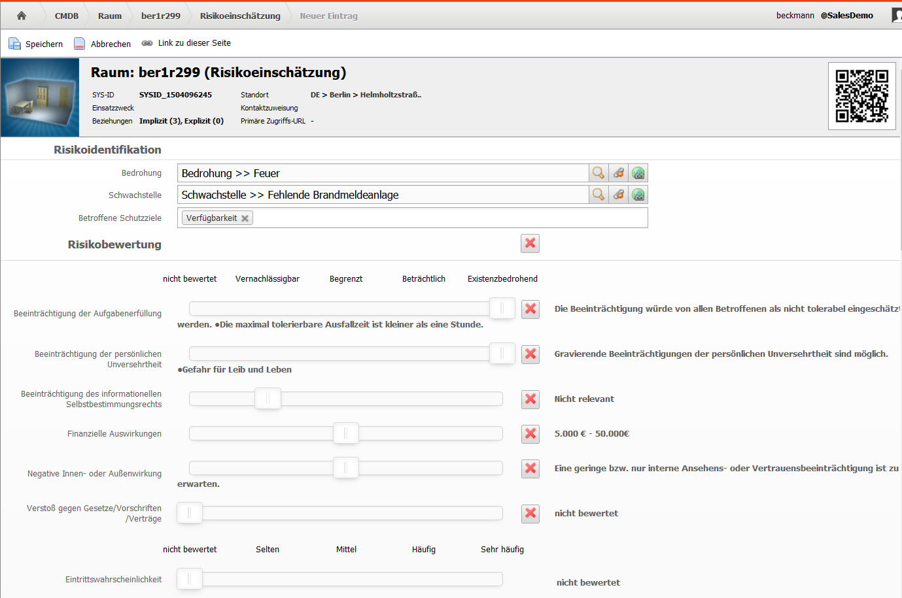
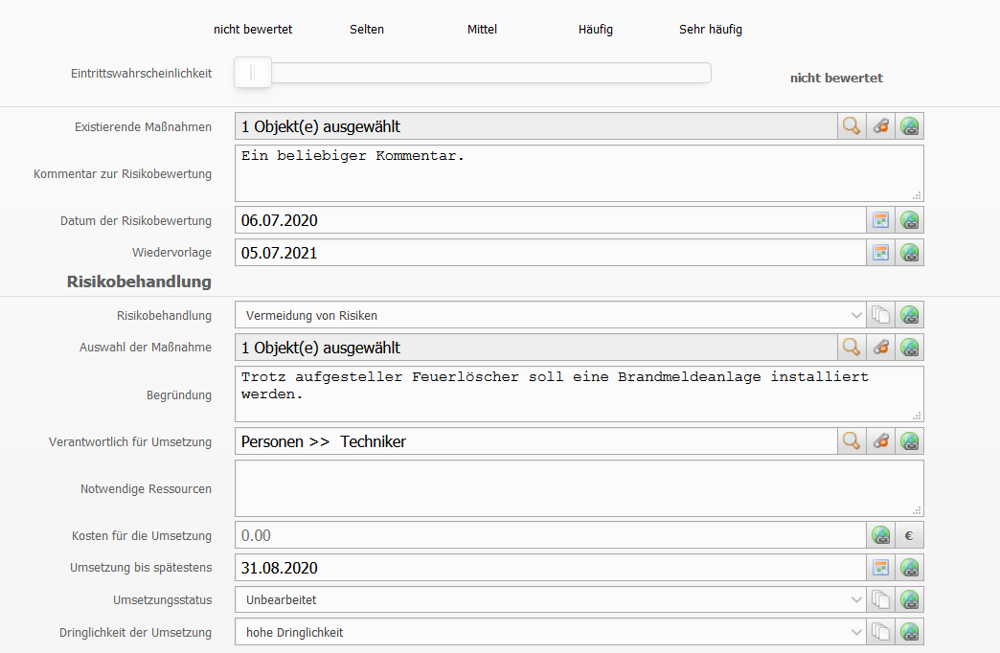
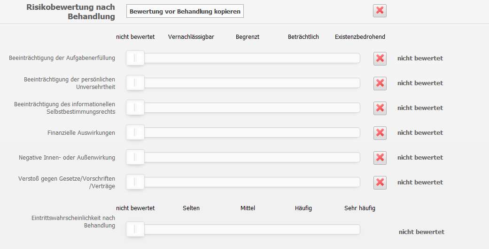

#######
Risikoeinschätzung vornehmen
#######

An jedem Objekt in i-doit findet sich nach der Installation des ISMS-Addon der Ordner "ISMS". Bei einem Klick auf den Ordner öffnet sich eine Kategorie-Ansicht, in der Sie die ISMS Relevanz und den Anwendungsbereich des Objektes definieren können.

Ein Klick auf die Kategorie Risikoeinschätzung öffnet die Multi-Value Kategorie "Risikoeinschätzung", in der Sie alle vorhanden Risikoeinschätzungen sehen und verwalten können.

Über den Button "Neu" können Sie eine neue Risikoeinschätzung erstellen:

Zunächst sind Bedrohung und Schwachstelle auszuwählen, die zusammen das Risiko ergeben. Außerdem können betroffene Schutzziele hinterlegt werden (Im Standard nur Vertraulichkeit, Integrität, Verfügbarkeit. Weitere Werte, wie Authentizität, können unter Verwaltung |pfeil| CMDB Einstellungen |pfeil| Dialog-Admin |pfeil| ISMS:Schutzziele hinzugefügt werden)

Im Abschnitt "Risikobewertung" finden sich nun Schieberegler, mit denen das Risiko anhand der `Schadensszenarien <objekttypen.html#objekttyp-schadensszenario>` bewertet werden kann.
An die Bewertung der Schadenszenarien schließt sich eine Einschätzung zur Eintrittswahrscheinlichkeit, ebenfalls per Schieberegler an.

Für die Risikobewertung können noch existierende Maßnahmen ausgewählt werden und ein Kommentar zur Riskobewertung angegeben werden. Das Datum der Risikobewertung und die Wiedervorlage sind Datum-Felder, die sich hervorragend in Reports auswerten lassen.

Nach der Risikobewertung können nun Angaben zur Risikobehandlung gemacht werden. Dabei können im Attribut Risikobehandlung die Werte aus der ISO 31000 ausgewählt werden. Bei den vorhanden Maßnahmen lassen sich beliebe Objekte vom Typ SOA-Maßnahme auswählen.

Neben dem Eintragen einer Begründung kann in diesem Abschnitt auch der "Verantworliche für die Umsetzung" eingetragen werden. Mit dem Platzhalter für den eingeloggten Benutzer, der ab i-doit 1.14.2 verfügbar ist, lässt sich auch dieses Attribut hervorragend nutzen um z.B. einen Report über Maßnahmen des jeweiligen Users direkt im Dashboard zu verankern.

Notwendige Ressourcen und Kosten für die Umsetzung gehören genauso wie das späteste Umsetzungsdatum, der Status und die Dringlichkeit der Umsetzung zu den Attributen im Abschnitt "Risikobehandlung". Die beiden zuletzt genannten Attribute sind Dialog-Plus Felder, deren Werte sich wie gewohnt unter Verwaltung |pfeil| CMDB Einstellungen |pfeil| Dialog-Admin einstellen lassen.

Im 3. Abschnitt der Risikoeinschätzung, der Risikobewertung nach Behandlung können mit dem Button "Bewertung vor Behandlung kopieren" alle Werte der Schieberegler von der Bewertung vor Risikobehandlung übernommen werden.
Natürlich können diese auch im Nachhinein noch angepasst werden und eine Eintrittswahrscheinlichkeit nach Behandlung per Schieberegler eingestellt werden:

Die Risikoeinschätzungen können natürlich nicht nur für einzelne Objekte, sondern auch für Objektgruppen (normalerweise in der Objekttypgruppe "Andere" zu finden) vorgenommen werden.
Damit die Risikoeinschätzungen dann an den einzelnen Objekten der Gruppe sichtbar werden, empfielt sich die Konfiguration der der mitgelieferten benutzerdefinierten Kategorie "Riskoeinschätzung-Gruppe" unter |pfeil| CMDB Einstellungen |pfeil| Benutzerdefinierte Kategorien |pfeil| ISMS Risikoeinschätzung (Gruppe).
.. |pfeil| unicode:: U+23F5