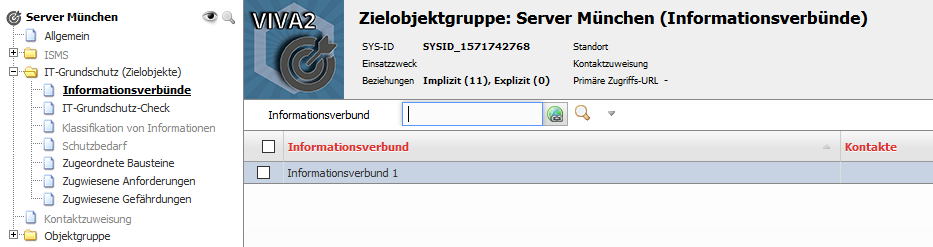
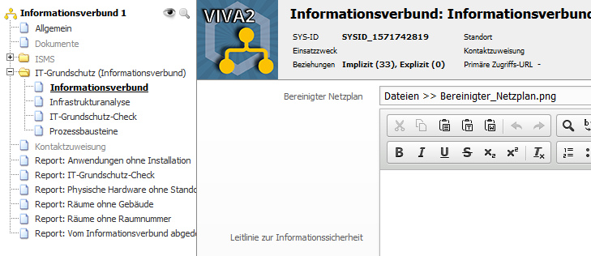

###############
Strukturanalyse
###############

Im Rahmen der Strukturanalyse muss sichergestellt werden, dass alle für die Dokumentation des Informationsverbund benötigten Objekte in i-doit angelegt sind. Dies umfasst unter anderem:

* Geschäftsprozesse
* Anwendungen
* IT-System
* ICS-Systeme
* Sonstige Geräte
* Räume

Des Weiteren müssen natürlich auch die Abhängigkeiten der Objekte untereinander vollständig in i-doit dokumentiert werden, u.a.:

* Welche Anwendungen gehören zu welchem Prozess?
* Auf welchen IT-System laufen welche Anwendungen?
* In welchen Räumen stehen welche IT-Systeme?

Unter :doc:`schutzbedarfsfeststellung` finden sich detailliertere Informationen, über welche Objektbeziehungen der Schutzbedarf vererbt wird.

**Gruppenbildung**

Zur Reduzierung der Komplexität sollten gleichartige Objekte im Objekttyp Zielobjektgruppe gruppiert werden. Der Typ der Objektgruppe muss dabei auf statisch gesetzt bleiben. Die Zielobjektgruppe wird dann über die Kategorie "Informationsverbünde" dem Informationsverbund zugeordnet werden. 

Es ist technisch möglich, eine Zielobjektgruppe mehreren Informationsverbünden zuzuordnen, es wird jedoch empfohlen, eine Zielgruppe immer nur einem Informationsverbund zuzuordnen.

**Zuordnung von einzelnen Objekten zum Informationsverbund**

Wenn es einzelne Objekte gibt, die dem Informationsverbund zugeordnet werden müssen und denen Bausteine zugeordnet werden müssen, dann gibt es zwei Möglichkeiten, dies umzusetzen:

#. Für dieses Objekt wird eine Zielobjektgruppe erstellt und das Objekt wird als einziges Objekt dieser Objektgruppe zugeordnet. Die Zielobjektgruppe wird dann ganz normal dem Informationsverbund zugewiesen.
#. Dem Objekttyp dieses Objekts wird über den Quick Configuration Wizard die Kategorie "IT-Grundschutz (Zielobjekte)" zugewiesen. In diesem Fall wird dann das Objekt direkt dem Informationsverbund zugewiesen.

**Verantwortlichkeiten**

Bei allen relevanten Objekten sollte die Dokumentation der Verantwortlichkeiten über die Kategorie Kontaktzuweisung vorgenommen werden.

**Bereinigter Netzplan**

Der bereinigte Netzplan sollte in der Kategorie "Informationsverbund" am Informationsverbund verlinkt werden.

**Kommunikationsverbindungen**

Die zu dokumentierenden Kommunikationsverbindungen werden über den neuen `Objekttypen Kommunikationsverbindung <objekttypen.html#objekttyp-kommunikationsverbindung>`_ in i-doit eingepflegt. 

Kommunikationsverbindungen werde in der Regel direkt dem Informationsverbund zugeordnet, deswegen ist dem Objekttypen "Kommunikationsverbindung" die Kategorie "IT-Grundschutz (Zielobjekte)" initial zugeordnet. Inder Kategorie "Informationsverbünde" muss dann noch der entsprechende Informationsverbund zugeordnet werden. 

Wenn in der Kategorie "Kommunikationsverbindung" Objekte bei "Verbindungsteilnehmer" eingetragen sind, dann wird in der Schutzbedarfsfeststellung der Schutzbedarf von diesen Objekten auf die Kommunikationsvererbung vererbt. 